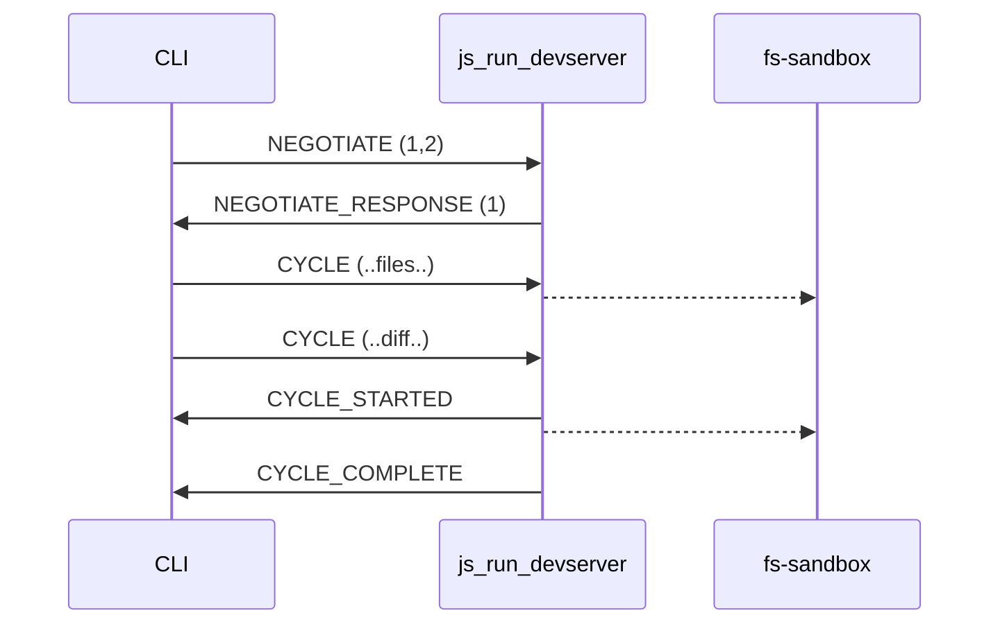
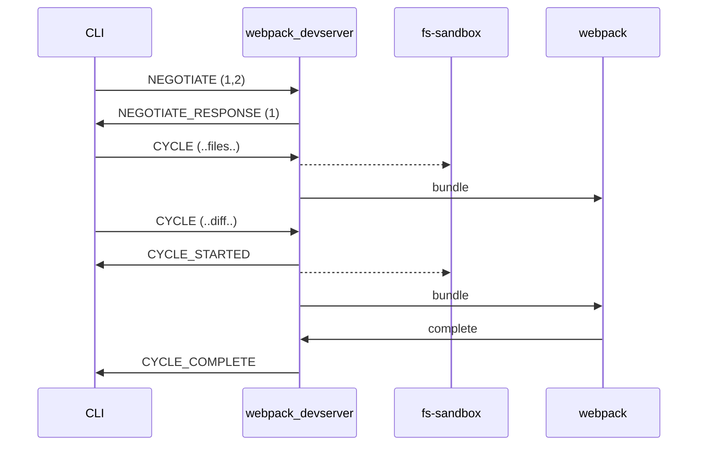

# Incremental Build Protocol

Owner: Şahin Yort, Jason Bedard
Protocol Version: 0

## Summary

The Incremental Build Protocol is a communication protocol for incremental builds, designed to coordinate between a host system (like a CLI) and an implementer (like a devserver or bundler). It addresses shortcomings of the ibazel protocol by enabling bidirectional communication, reporting of input changes, and avoiding the use of standard streams for communication.

## Terminology

- Implementer: the binary accepting protocol messages, for example the `js_run_devserver` node process
- Host: the system sending protocol messages to the implementer, for example the Aspect CLI

## Requirements

- MUST not occupy any of the standard streams for protocol use.
- Works bidirectionally, host and the implementer MAY talk to each other for better coordination. Sending timing, events, and deciding when/if implementer should receive further events.
- Host MUST be capable of reporting input changes to the implementer
- MUST NOT use `tags` hence use of cquery for protocol support detection.

## Design

Unix sockets are used for communication, the path to the UNIX socket is set by the `ABAZEL_WATCH_SOCKET_FILE` environment variable by the host before launching the implementer. Bidirectional communication is used over this socket to exchange JSON messages, events, commands etc.

In order to indicate that the implementer supports this protocol it must open a connection to the socket and send an initial `NEGOTIATE` message.

A target MAY add the `supports_incremental_build_protocol` tag to signal to the host that the target is capable of speaking abazel but this is not required. This tag MAY be used by the host to determine if/when it should fallback to other mechanisms such as ibazel.

## Workflow

The workflow consists of the following steps:

1. **Connect**: the implementer connects to the UNIX socket specified by the `ABAZEL_WATCH_SOCKET_FILE` environment variable.
2. **Negotiation**: The host and implementer exchange `NEGOTIATE` messages to agree on the protocol version.
3. **Cycles**: The host sends `CYCLE` messages to inform the implementer of changes in input files. The implementer responds with an initial `CYCLE_STARTED` followed by `CYCLE_COMPLETED|CYCLE_ABORTED|CYCLE_FAILED` on completion.
4. **Exit**: The host or implementor can send an `EXIT` message to indicate the end of the session.

## Message Definitions

Messages are all JSON objects with a `kind` field indicating the message type.

#### Negotiate

Apon initial connect the host sends an initial `NEGOTIATE` message declaring the supported protocol versions:
```json
  {
    "kind": "NEGOTIATE",
    "versions": [1,2,3],
  },
```

The implementor responds with the selected version:
```json
  {
    "kind": "NEGOTIATE_RESPONSE",
    "version": 3
  },
```

#### Cycle

Once negotiation is complete the host will start sending `CYCLE` messages to inform the implementor of changes to the input files, including an initial `CYCLE` with the full set of input files.

```json
  {
    "kind": "CYCLE",
    "cycle_id": 1,
    // List of sources that have either deleted or changed.
    // TreeArtifacts are expanded automatically, if its empty there is
    "sources": {
        // Changed files
			  "./path/to/foo": {
					 "is_symlink": true,
			  },
			  "./path/to/bar": {
					 "is_source": true,
			  },
        // REMOVED
        "./path/to/deleted/source.txt": null,
    }
  }
```

The implementor should then send a `CYCLE_STARTED` to indicate work has started, followed by `CYCLE_FAILED|CYCLE_ABORTED|CYCLE_COMPLETED` messages in response to indicate the result of processing the cycle.

```json
  // Cycle started (implementor => host)
  {
    "kind": "CYCLE_STARTED",
    "cycle_id":  1
  },
```

```json
  // Cycle ended successfully (implementor => host)
  {
    "kind": "CYCLE_COMPLETED",
    "cycle_id": 1
  }
```

```json
  // Cycle aborted (implementor => host)
  {
    "kind": "CYCLE_ABORTED",
    "cycle_id": 1
  },
```

```json
  // Cycle failed (implementor => host)
  {
    "kind": "CYCLE_FAILED",
    "cycle_id":  1,
    // optionally can set a reason.
    "description": "bundling error abcd",
    // cycle failed can send a follow up EXIT event to tell host that it must exit
    // because the failure is non-recoverable.
  },
```

At any time the host or implementor can send an `EXIT` message to indicate that it is going to exit.

```json
  // A generic exit notification to host that the implementor is going to exit now. (implementor <=> host)
  {
	  "kind": "EXIT",
	  "description": "Webpack went into bad state and wants kill itself."
  },
```

#### Unimplemented / Future

Capabilities to opt-in to additional capabilities and features.

```json
  // DIRECTION: host to implementor
  {
    "kind": "CAP",
    "cap": {
      // host can detect changes to the generated sources.
      "**detect_generated_sources**": true,
      // host can detect if inputs are symlnks
      "**detect_symlinks**": true,
      // host can report mtime changes.
      "**report_mtime**": true,
      // host can report changes to the build file.
      // TODO: this is an idea
      "**report_build_file_changes**": true,
      // host supports persistent sandboxes for fast devserver.
      "**preserve_context**": true,
      // which scopes
      "**report_target_scope"**: true,
      "**report_source_tree_scope": true,
      "expand_tree_artifacts": {
        "if_path_not_includes": "/node_modules/"
      }**
    }
  },
  // DIRECTION: implementor to host
  // TODO: should there be a separate message to enable disable caps?
  {
    "kind": "CAP",
    "enable_caps": {
      // implementor can cancel in-flight builds
      "**abort_inflight_cycle**": true,
      // supports preserving context, eg persitent sandbox folder.
      "**preserve_context**": true,
      // enable the target and source_tree scopes
      "**report_target_scope"**: true,
      "**report_source_tree_scope": true,**
    },
  },

  // Abort inflight cycle
  {
	  // Possible responses to this command is:
	  // CYCLE_COMPLETED -> Means by the time abort was received the cycle was completed.
	  // CYCLE_ABORTED -> Implementor succesfully aborted the specified `cycle_id`.
	  // CYCLE_FAILED -> Where it MAY have attempted an abort but led to a failure,
	  // semantics of this is identical to receiving a CYCLE_FAILED after CYCLE_STARTED.
    "kind": "CYCLE_ABORT"
    "cycle_id":  1
  }

  // DIRECTION: implementor -> host
  // about additional spans sent to the host for timing info.
  // note that this is up to the host how to interpret this information.
  {
    "kind": "TIMING_SPAN_START",
    // an optional cycle_id that ties this span to a cycle
    "cycle_id": 1,
    "timing": {
      "id": "webpack.12345",
      "description": "Webpack Devserver started",
    }
  },
  {
    "kind": "TIMING_SPAN_END",
    // an optional cycle_id that ties this span to a cycle
    "cycle_id": 1,
    "timing": {
	    // This id MUST match TIMING_SPAN_START.
      "id": "webpack.12345",
      "description": "Webpack Devserver finished",
    }
  }
```

Example: js_run_devserver simply copying a set of files into a sandbox. A tool such as webpack may then be watching the sandbox to perform its own standalone actions



Example: a tool such as a webpack devserver may coordinate events between webpack and the CLI better to ensure no modifications are done to the fs-sandbox while a webpack task is running


