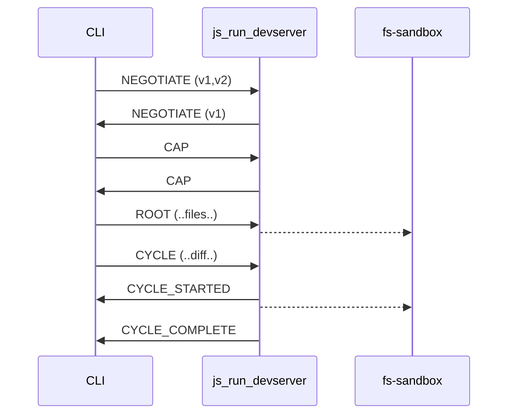
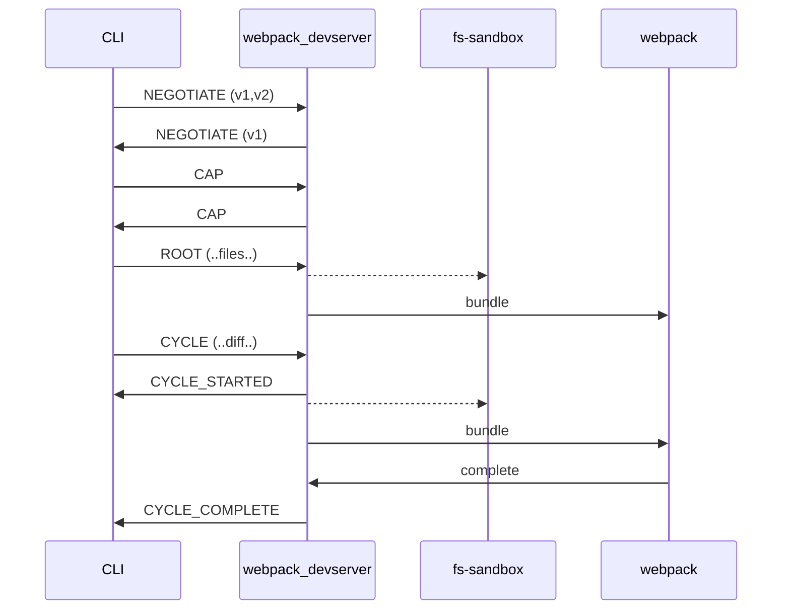

# Incremental Build Protocol

Owner: Şahin Yort
Last edited time: October 23, 2025 7:54 PM
Status: Proposed

<aside>
💡

This documentation is not about Watch. It merely a ibazel protocol replacement.

</aside>

## Summary

The Incremental Build Protocol provides a replacement for ibazel's protocol with better control over the subprocess.

Key points:

- Protocol replacement focuses solely on build functionality, it does not specify how watching is done or how the protocol implemented.
- It does not strive to be drop in replacement for existing iBazel protocol. However, it might recommend approaches for supporting both.

## Terminology

- Implementer: the binary accepting protocol messages, for example the js_run_devserver node process
- Host: the system sending protocol messages to the implementer, for example the Aspect CLI

## Background

Currently, the only way to implement an incremental workflows, for example devservers, bundlers, is through the ibazel protocol. While it works well for basic use cases, it has several shortcomings that force implementers to create workarounds.

Shortcomings include:

- Protocol having no insights as what the implementer is doing, whether it finished, failed, or is still performing the task at hand. Simply because the protocol is designed for only one way communication.
- Protocol does not support reporting of inputs that have changed, forcing implementer to invent filesystem diff pipelines.
- Protocol uses stdin for communication which breaks some tools that expect TTY for stdin.

These shortcomings simply can not be fixed with the existing ibazel protocol, since many of them require breaking changes to the protocol. Instead, we are drafting a complete new protocol that we call “INCREMENTAL BUILD PROTOCOL”

## Requirements

- MUST not occupy any of the standard streams for protocol use.
- Works bidirectionally, host and the implementer MAY talk to each other for better coordination. Sending timing, events, and deciding when/if implementer should receive further events.
- Host MUST be capable of reporting input changes to the implementer
- MUST NOT use `tags` hence use of cquery for protocol support detection.

## Design

 Instead unix sockets are used for communication, the path to the UNIX socket is set by the `TBD_PROTOCOL_SOCKET` environment variable.

In order to indicate that the implementer supports this protocol, it will have to touch the file path set by the `TBD_PROTOCOL_STATUS` environment variable. This is similar to bazel test runners indicating [support for test sharding](https://bazel.build/reference/test-encyclopedia#test-sharding).

For legacy reasons rules supporting both `ibazel` and `abazel` MAY add the `supports_abazel` to signal to the host that the target is capable of speaking abazel. presence of this tag implies  the host MAY prefer abazel over ibazel.

### Overview

```json
  // the first message that the host and the implementor exchange.
  // this message is the only stable message that is guaranteed to be
  // stable across major versions of this protocol.
  // host to implementor
  {
    "kind": "NEGOTIATE",
    "versions": [1,2,3],
  },
  // implementor to host
  {
    "kind": "NEGOTIATE",
    "version": 3
  },


  // DIRECTION: host to implementor
  {
    "kind": "CAP",
    "cap": {
      // host can detect changes to the generated sources.
      "**detect_generated_sources**": true,
      // host can detect if inputs are symlnks
      "**detect_symlinks**": true,
      // host can report mtime changes.
      "**report_mtime**": true,
      // host can report changes to the build file.
      // TODO: this is an idea
      "**report_build_file_changes**": true,
      // host supports persistent sandboxes for fast devserver.
      "**preserve_context**": true,
      // which scopes
      "**report_target_scope"**: true,
      "**report_source_tree_scope": true,
      "expand_tree_artifacts": {
        "if_path_not_includes": "/node_modules/"
      }**
    }
  },
  // DIRECTION: implementor to host
  // TODO: should there be a separate message to enable disable caps?
  {
    "kind": "CAP",
    "enable_caps": {
      // implementor can cancel in-flight builds
      "**abort_inflight_cycle**": true,
      // supports preserving context, eg persitent sandbox folder.
      "**preserve_context**": true,
      // enable the target and source_tree scopes
      "**report_target_scope"**: true,
      "**report_source_tree_scope": true,**
    },
  },

  // bazel lint --watch   uses `source_tree` scope
  // bazel test //target  uses `target` scope
  // bazel run  //target  uses `target` scope
  // bazel run :gazelle   uses `source_tree` scope
  // bazel run configure. uses `source_tree` scope


  // DIRECTION: host to implementor
  // Information about the incremental build
  {
    "kind": "INFO",
    "info": {
		   // in response to can_preserve_context:true
       "context": "/my/root/dir/{hash}",
       "target": "//my/bazel:target"

       // Additional vendor specific attributes.
       // Should be namespaced
       "aspect:cli-version": "cli-1.2.3",
    }
  }

  // DIRECTION: host to implementor

  // Host will never send a subsequent CYCLE command until it receives one of
  // the following notifications from the implementor;
  // CYCLE_COMPLETED | CYCLE_FAILED | CYCLE_ABORTED
  {
    "kind": "CYCLE",
    "cycle_id": 1,
    "scope": "source_tree", // optional, depending on the capability
    // This cycle contains a full list of sources, diffing from an empty/null state
    // Implementors should sign this of starting a fresh sandbox
    "is_fresh": true,
    // List of sources that have either deleted or changed.
    // TreeArtifacts are expanded automatically, if its empty there is
    "sources": {
		    // AN EMPTY DIRECTORY
			  "./path/to/empty/tree-artifact": {
			     "is_directory": true,
			  },
			  "./path/to/empty/tree-artifact": {
					 "is_directory": true,
					 // Children is a flat list of all the entries.
					 "children": {
					   ".github/FUNDING.yml": {},
						 // An empty directory with no siblings
					   "empty_dir": { "is_directory": true },
						 "remove_file": null,
					 }
			  },
			  // IF the directory containts some content, then it will be flattened
			  // and expanded, semantics of treeartifact contents is identical of
			  // other  files.
			  // CHANGED
			  "./path/to/empty/tree-artifact/file.txt": {
			      "mtime": 127288228
			      "generated": true,
			  },
			  // CHANGED
        "./path/relative/to/runfiles/source.txt": {
          // see `can_report_mtime` CAP above.
          "mtime": 1272882282
          // true | false or null if CAP_can_detect_generated_sources is false.
          "generated": true,
        },
        // REMOVED
        "./path/to/deleted/source.txt": null,
    }
  },

  // Abort inflight cycle
  {
	  // Possible responses to this command is:
	  // CYCLE_COMPLETED -> Means by the time abort was received the cycle was completed.
	  // CYCLE_ABORTED -> Implementor succesfully aborted the specified `cycle_id`.
	  // CYCLE_FAILED -> Where it MAY have attempted an abort but led to a failure,
	  // semantics of this is identical to receiving a CYCLE_FAILED after CYCLE_STARTED.
    "kind": "CYCLE_ABORT"
    "cycle_id":  1
  }


  // DIRECTION: implementor -> host
  // Cycle started
  {
    "kind": "CYCLE_STARTED",
    "cycle_id":  1
  },
  // Cycle ended
  {
    "kind": "CYCLE_COMPLETED",
    "cycle_id": 1
  },
  // Cycle aborted
  {
    "kind": "CYCLE_ABORTED",
    "cycle_id": 1
  },
  // Cycle failed
  {
    "kind": "CYCLE_FAILED",
    "cycle_id":  1,
    // optionally can set a reason.
    "description": "bundling error abcd",
    // cycle failed can send a follow up EXIT event to tell host that it must exit
    // because the failure is non-recoverable.
  },

  // DIRECTION: implementor -> host
  // A generic exit notification to host that the implementor is going to exit now.
  {
	  "kind": "EXIT",
	  "description": "Webpack went into bad state and wants kill itself."
  },

  // DIRECTION: implementor -> host
  // about additional spans sent to the host for timing info.
  // note that this is up to the host how to interpret this information.
  {
    "kind": "TIMING_SPAN_START",
    // an optional cycle_id that ties this span to a cycle
    "cycle_id": 1,
    "timing": {
      "id": "webpack.12345",
      "description": "Webpack Devserver started",
    }
  },
  {
    "kind": "TIMING_SPAN_END",
    // an optional cycle_id that ties this span to a cycle
    "cycle_id": 1,
    "timing": {
	    // This id MUST match TIMING_SPAN_START.
      "id": "webpack.12345",
      "description": "Webpack Devserver finished",
    }
  }
```

Example: js_run_devserver simply copying a set of files into a sandbox. A tool such as webpack may then be watching the sandbox to perform its own standalone actions



Example: a tool such as a webpack devserver may coordinate events between webpack and the CLI better to ensure no modifications are done to the fs-sandbox while a webpack task is running



### Preconditions / invariants

### Alternatives Considered

### Future work

- live reload?
