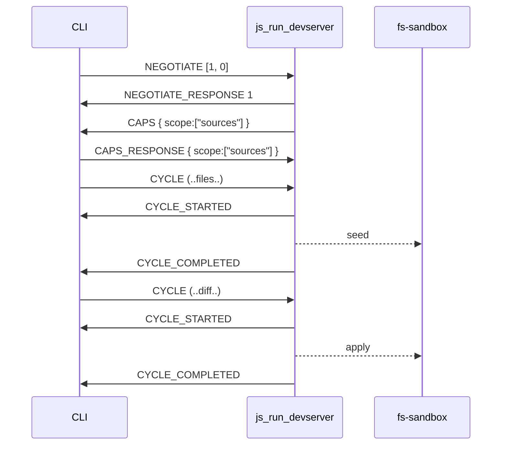
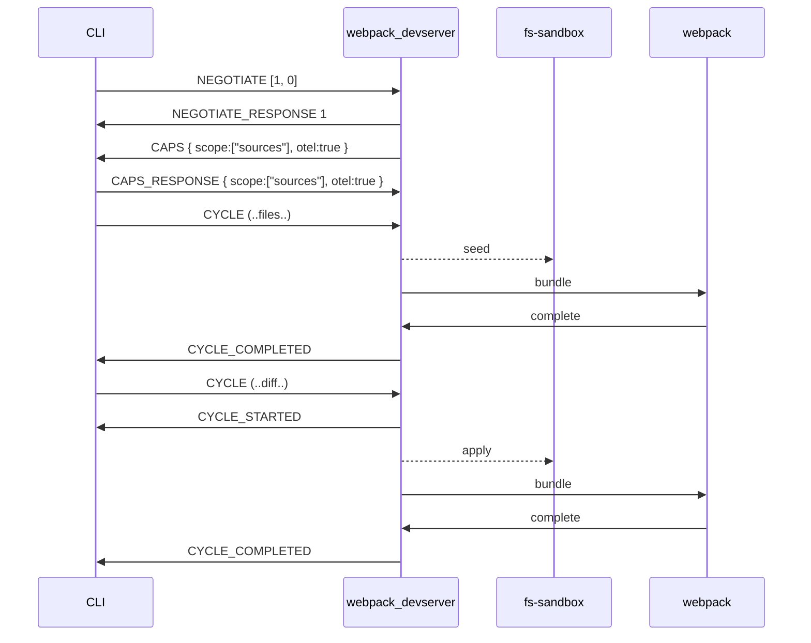

# Incremental Build Protocol

Owner: Şahin Yort, Jason Bedard
Protocol Version: 1

## Summary

The Incremental Build Protocol is a communication protocol for incremental builds, designed to coordinate between a host system (like a CLI) and an implementer (like a devserver or bundler). It addresses shortcomings of the ibazel protocol by enabling bidirectional communication, reporting of input changes, and avoiding the use of standard streams for communication.

## Terminology

- Implementer: the binary accepting protocol messages, for example the `js_run_devserver` node process
- Host: the system sending protocol messages to the implementer, for example the Aspect CLI

## Requirements

- MUST not occupy any of the standard streams for protocol use.
- Works bidirectionally, host and the implementer MAY talk to each other for better coordination. Sending timing, events, and deciding when/if implementer should receive further events.
- Host MUST be capable of reporting input changes to the implementer
- MUST NOT use `tags` hence use of cquery for protocol support detection.

## Design

Unix sockets are used for communication, the path to the UNIX socket is set by the `ABAZEL_WATCH_SOCKET_FILE` environment variable by the host before launching the implementer. Bidirectional communication is used over this socket to exchange JSON messages, events, commands etc.

In order to indicate that the implementer supports this protocol it must open a connection to the socket and send an initial `NEGOTIATE_RESPONSE` to the host's `NEGOTIATE` message.

A target MAY add the `supports_incremental_build_protocol` tag to signal to the host that the target is capable of speaking abazel but this is not required. This tag MAY be used by the host to determine if/when it should fallback to other mechanisms such as ibazel.

## Workflow

1. **Connect**: the implementer connects to the UNIX socket specified by the `ABAZEL_WATCH_SOCKET_FILE` environment variable.
2. **Negotiation**: The host sends a `NEGOTIATE` message listing supported protocol versions in priority order. The implementer responds with `NEGOTIATE_RESPONSE` indicating the selected version.
3. **Capability handshake (v1+)**: The implementer sends a `CAPS` message listing the capabilities it would like to enable. The host replies with `CAPS_RESPONSE` echoing the negotiated set (possibly clamped to what the host supports).
4. **Cycles**: The host sends `CYCLE` messages to inform the implementer of changes in input files. The implementer responds with an initial `CYCLE_STARTED` followed by `CYCLE_COMPLETED|CYCLE_ABORTED|CYCLE_FAILED` on completion.
5. **Exit**: The host or implementor can send an `EXIT` message to indicate the end of the session.

## Versioning

| Version | Notes |
|--------:|-------|
| 0       | Legacy. No `CAPS` handshake. No scope. No OTEL. `is_fresh` flag on `CYCLE`. |
| 1       | Adds `CAPS`/`CAPS_RESPONSE` handshake, `scope` and `otel` capabilities. OTEL `trace_id`/`span_id` MAY be set on any message when the `otel` capability is negotiated. |

The host SHOULD list versions in `NEGOTIATE.versions` in priority order — most preferred first. The implementer SHOULD select the first listed version it supports.

## Capabilities (v1+)

Capabilities are requested by the implementer via `CAPS` and confirmed by the host via `CAPS_RESPONSE`. The `caps` map keys are capability names; values are capability-specific.

| Capability | Value type | Meaning |
|------------|-----------|---------|
| `scope`    | `("sources" \| "runfiles")[]` | Scopes the implementer wants `CYCLE` events for. Default when omitted: `["runfiles"]`. |
| `otel`     | `bool` | When `true`, both sides MAY include `trace_id` and `span_id` on any message to propagate OTEL trace context. |

The host MAY return a smaller set than was requested if it does not fully support a capability.

## Message Definitions

Messages are JSON objects terminated with a newline. Every message has a `kind` field.

When the `otel` capability is negotiated, any message MAY also include:

```json
  "trace_id": "<hex trace id>",
  "span_id":  "<hex span id>"
```

#### Negotiate

Apon initial connect the host sends an initial `NEGOTIATE` message declaring the supported protocol versions:
```json
  {
    "kind": "NEGOTIATE",
    "versions": [1,2,3],
  },
```

The implementor responds with the selected version:
```json
  {
    "kind": "NEGOTIATE_RESPONSE",
    "version": 3
  },
```

#### Caps (v1+)

After `NEGOTIATE_RESPONSE`, when version >= 1, the implementer sends:

```json
  {
    "kind": "CAPS",
    "caps": {
      "scope": ["sources", "runfiles"],
      "otel":  true
    }
  }
```

The host replies, echoing the agreed set:

```json
  {
    "kind": "CAPS_RESPONSE",
    "caps": {
      "scope": ["sources", "runfiles"],
      "otel":  true
    }
  }
```

#### Cycle

Once the handshake is complete the host drives the loop with `CYCLE` messages.

```json
  {
    "kind": "CYCLE",
    "cycle_id": 1,
    // Only present when the `scope` capability is negotiated.
    "scope": "sources",
    // Map of sources that have either deleted or changed.
    "sources": {

        // Changed files
      "./path/to/foo": { "is_symlink": true },
      "./path/to/bar": { "is_source":  true },
        // REMOVED
      "./path/to/deleted/source.txt": null
    }
  }
```

`sources` MAY be `null` to signal a **reset**: the host has lost its prior delta state (e.g. the file watcher restarted) and the implementor MUST treat the next cycle as a full sync rather than applying it as a delta. A `null` `sources` is not equivalent to an empty map — an empty map is "no changes since last cycle"; `null` is "an unknown number of changes may have occurred".

```json
  {
    "kind": "CYCLE",
    "cycle_id": 1,
    "scope": "sources",
    "sources": null
  }
```

The implementor responds with `CYCLE_STARTED` to indicate work has begun, followed by exactly one of `CYCLE_COMPLETED | CYCLE_ABORTED | CYCLE_FAILED`.

```json
  // Cycle started (implementor => host)
  {
    "kind": "CYCLE_STARTED",
    "cycle_id":  1
  },
```

```json
  // Cycle ended successfully (implementor => host)
  {
    "kind": "CYCLE_COMPLETED",
    "cycle_id": 1
  }
```

```json
  // Cycle aborted (implementor => host)
  {
    "kind": "CYCLE_ABORTED",
    "cycle_id": 1
  },
```

```json
  // Cycle failed (implementor => host).
  // The implementor MAY follow up with EXIT for non-recoverable failures.
  {
    "kind": "CYCLE_FAILED",
    "cycle_id":  1,
    "description": "bundling error abcd"
  }
```

#### Cycle Abort

Either side at any time:

```json
  // Possible responses are CYCLE_COMPLETED, CYCLE_ABORTED, or CYCLE_FAILED.
  {
    "kind": "CYCLE_ABORT",
    "cycle_id": 1
  }
```

#### Exit

At any time the host or implementor can send an `EXIT` message to indicate it is going to exit.

```json
  {
    "kind": "EXIT",
    "description": "Webpack went into bad state and wants kill itself."
  }
```

## Examples

`js_run_devserver` simply copying a set of files into a sandbox. A tool such as webpack may then be watching the sandbox to perform its own standalone actions:



A tool such as a webpack devserver may coordinate events between webpack and the CLI to ensure no modifications are done to the fs-sandbox while webpack is bundling:


